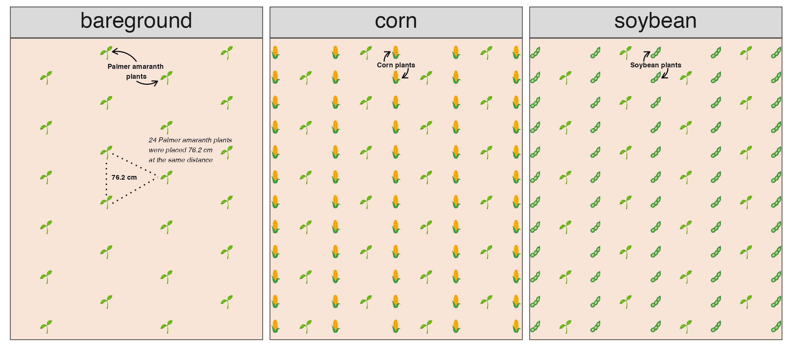
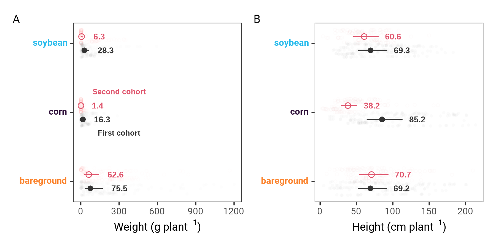
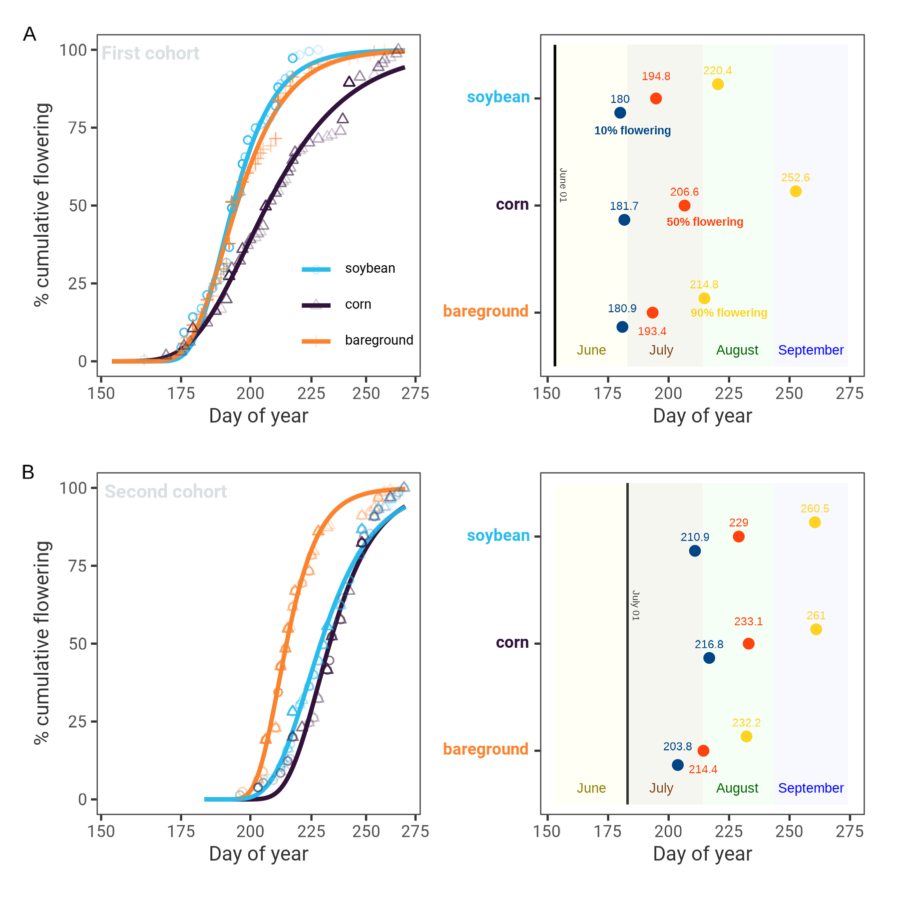

```{r include=FALSE}
library(kableExtra)
library(tidyverse)
```

\begin{abstract}

Palmer amaranth (\emph{Amaranthus palmeri} S. Watson) is one of the most troublesome agronomic weed species in the United States. Palmer amaranth is endemic to Southern United States but its range is expanding northward. Palmer amaranth dispersal warrants studies assessing species adaptation into new geographies. A study was conducted to investigate morphology, flowering and gender from cohorts of Palmer amaranth growing under corn, soybean, and bareground across five locations of US Midwest. Results demonstrated that first cohort of Palmer amaranth, established in June, produced 42\% more biomass than plants from second cohort (established in July). The first Palmer amaranth cohort produced 75.5 g plant\textsuperscript{-1} in bareground, 28.3 g plant\textsuperscript{-1} in soybean and 16.3 g plant\textsuperscript{-1} in corn, whereas the second Palmer amaranth cohort produced 62.6, 6.3, and 1.4 g plant\textsuperscript{-1} in bareground, soybean and corn, respectively. Palmer amaranth height was more impacted when growing in corn. Palmer amaranth plants averaged 85.2 cm tall in the first cohort but 38.2 cm tall in the second cohort in corn. Moreover, Palmer amaranth flowering window shifted according to crop and cohort timings. Palmer amaranth growing in intense competition, such as under low light in corn, resulted in the longest flowering window. Also, Palmer amaranth sex dimorphism was slightly influenced by day of year, weight and height. The model estimated that probability of being a female plant increased as biomass and height increased. Our results showed the fast adaptation and plasticity of Palmer amaranth to grow and adapt to cropping systems from the US Midwest. Palmer amaranth is likely to continue its expansion northward. Therefore, preventing plant dispersal into new habitats is the most effective management strategy. Reactive management to reduce Palmer amaranth impact on cropping systems should encompass diversity of tactics that minimize the species ability to establish into cropping systems, including crop rotation (beyond corn and soybean), early/late crop planting, row spacing, cover crops, and effective chemical control programs.

\tiny
 \keyFont{ \section{Keywords:} Evolution, Flowering, Management, Pigweed, Weed} 

\end{abstract}


# Introduction {-}
Palmer amaranth (*Amaranthus palmeri* S. Watson) is currently ranked as one of the most economically detrimental weed species to cropping systems in the United States [@vanwychen2020]. Unmanaged Palmer amaranth plants compete for water, light, and nutrients, which can drastically impact crop yields [@berger2015]. For example, Palmer amaranth has been documented to reduce up to 91%, 68%, and 54% corn [@massinga2001], soybean [@klingaman1994], and cotton [@morgan2001] yields, respectively. Moreover, Palmer amaranth has shown a remarkable capacity to evolve resistance to herbicides. To date, Palmer amaranth has evolved resistance to eight herbicide sites of action [@heap2021], increasing the weed management complexity [@lindsay2017]. Thus, Palmer amaranth poses an economical and ecological risk to sustainable agriculture.

Palmer amaranth is a fast growing summer annual forb indigenous to the Sonoran Desert [@sauer1957]. The species would eventually emerge as a threat to US agriculture in the 1990s. Palmer amaranth weediness is likely a result of human-assisted selection in combination with plant biology. Farm mechanization, adoption of conservation agriculture (e.g., no-till), and intensive use of herbicides for weed management are the main human-mediated selections of Palmer amaranth into cropping systems [@ward2013]. On the other hand, Palmer amaranth is a prolific seed producer with a C4 photosynthetic apparatus [@wang1992]. With a dioecious nature, Palmer amaranth male and female plants are obligate outcrosser species, increasing the chances of exchanging adaptive traits among plants [@jhala2021; @oliveira2018]. Also, Palmer amaranth's small seeds (e.g, 1 mm) tend to thrive in no-tillage systems [@price2011], and spread across locations through farm equipment [@sauer1972], seed mixes [@hartzler2016], wildlife [@farmer2017], etc. The dispersal capacity of Palmer amaranth makes the species one of the most successful cases of weed adaptation to current cropping systems. 

Light and temperature are the main environmental requirements for Palmer amaranth growth and development [@jha2010]. Palmer amaranth is reported with an extended germination period [@ward2013]. Germination of Palmer amaranth was triggered by 18 C soil temperature at 5 cm depth [@keeley1987], and optimal germination and biomass production occurred at 35/30 C day and night temperatures [@guo2003]. In addition, Palmer amaranth emergence is human-mediated by tillage timings and preemergence-applied herbicides [@chahal2021], which can result in weed germination shifts [@sbatella2010]. Also, Palmer amaranth has shown to grow and develop under reduced soil water content. In continuous water stress, Palmer amaranth survived and produced at least 14000 seeds plant\textsuperscript{-1} [@chahal2018]. Seeds from Palmer amaranth growing with limited water conditions were heavier, less dormant, and prompt for germination [@matzrafi2021]. Growing conditions and management practices also influence Palmer amaranth sex dimorphism and flowering pattern [@korres2017; @rumpa2019]. Therefore, Palmer amaranth has shown plasticity to evolve and fast adapt under the current agroecosystem conditions. Future scenarios suggest that global temperature warming can impact agriculture, and promote niches for Palmer amaranth invasion/adaptation into new environments. Agronomic crops in Australia and Sub-Sahara Africa are currently at greatest risk to Palmer invasion as climate warms [@kistner2018]. Temperature is a key factor limiting Palmer amaranth expansion to cooler geographies [@briscoerunquist2019]; however, under future climate change Palmer amaranth is likely to expand northward into Canada and Northern Europe [@kistner2018; @briscoerunquist2019].


Palmer amaranth is already found in agronomic crops of South America [@larran2017; @kupper2017] and Southern Europe [@milani2021]. In the United States, Palmer amaranth is well established in the Cotton Belt [@garetson2019; @bagavathiannan2016] in the southern United States but its range is expanding northward. For example, herbicide resistant Palmer amaranth is widespread in Nebraska  [@oliveira2021a]. There are some reported cases of Palmer amaranth in Michigan [@kohrt2017] and Connecticut [@aulakh2021]. Also, it is estimated that Palmer amaranth can cause yield loss to soybean fields in Illinois [@davis2015], which is concerning as soybean along with corn comprise most of US Midwest agronomic hectares. In Iowa, a study showed that Palmer amaranth is still not well adapted compared to waterhemp (*Amaranthus tuberculatus*) [@baker2021], which is considered the most troublesome species in the US Midwest [@tranel2011]. Invasion and successful eradication of Palmer amaranth is documented in Minnesota [@yu2021]. Palmer amaranth infestations have not been detected in Canada; however, Palmer amaranth seeds were detected in sweet potato slips in the country [@page2021]. Palmer amaranth is still not as well adapted and established to Northern as compared to Southern North America. Therefore, Palmer amaranth range of expansion into new habitats can increase. It seems certain the need to manage new Palmer amaranth infestations in agronomic crops throughout northern United States is eminent in the near future. Strategies on Palmer amaranth management should encompass the agroecosystem level but not focus only on attempts to eradicate the weed. Most tactics to manage Palmer amaranth are based on technological solutions [@scott2011], which are short-term (e.g., herbicide and/or tillage) rather than long-term weed management. Palmer amaranth management should be built around minimizing the species ability to adapt, grow and develop successfully in agroecossystems. 

In the southeastern US, early growing Palmer amaranth is well known to have a higher impact on cotton yields compared to late established plants [@macrae2013]. In the northern states, Palmer amaranth impact on the agroecosystem is recent. Studies investigating Palmer amaranth in northern states are limited due to the plant classification as noxious weed species [@yu2021]. Nonetheless, the continuous Palmer amaranth dispersal and potential establishment across the northern United States is concerning and warrants investigations on species morphology in northern environments. Understanding Palmer amaranth biology and morphology under different agroecosystems can enhance our knowledge on species adaptation and management practices. It can also aid in designing proactive and ecological tactics to limit the species range expansion, reduce its negative impact on agroecossystems, and to develop resilient and sustainable farming systems [@maclaren2020]. Therefore, the objective of this study was to investigate the flowering pattern, sex dimorphism, biomass production, and height of Palmer amaranth cohorts growing under corn, soybean and bareground across five locations in the United States Midwest. 


# Material and Methods {-}

<!-- Comments should be HTML-style comments -->

## Plant material and growing conditions {-} 

A Palmer amaranth accession (Kei3) from Perkins County, Nebraska with no glyphosate resistance according to @oliveira2021a was selected for this study. Three weeks prior to the establishment of each cohort, seeds were planted in plastic trays containing potting-mix. Emerged seedlings (1 cm) were transplanted into 200 cm\textsuperscript{-3} plastic pots (a plant pot\textsuperscript{-1}). Palmer amaranth seedlings were supplied with adequate water and kept under greenhouse conditions at the University of Wisconsin-Madison, University of Nebraska-Lincoln, and Western Illinois University; and kept outdoors at the Perkins extension office in Grant, NE until the 2-3 leaf stage (5 to 8 cm height) when they were transported to the field.

## Field study {-}  

The experiment was conducted in 2018 and 2019 under field conditions at five locations: Arlington, WI (43°18'N, 89°29'W), Clay Center, NE (40.57'N, 9814'W), Grant, NE (40.85'N, -101.70'W), Lincoln, NE (41.16'N, 96.42'W), and Macomb, IL (XXX'N, XXX'W).  

Fields were conventionally tilled prior to crop planting. Corn and soybean were planted in 76-cm row spacing (Table 1). Monthly mean air temperature and total precipitation were obtained using Daymet weather data from June through September across the five locations in 2018 and 2019 [@correndo2021] (Figure 1)

```{r fig1, echo = FALSE, message=FALSE, fig.show = "hide"}
knitr::include_graphics("../data analysis/weather/Figure 1.png")
```


```{r echo=FALSE, warning=FALSE, message=FALSE}
options(knitr.kable.NA = '')
read_csv("../data/table.csv") %>% 
  janitor::row_to_names(row_number = 1) %>% 
  kable(booktabs = TRUE, caption = "Field study attributes ",
        col.names = c("Attributes",
                           "",
                           "Arlington, WI",
                           "Clay Center, NE",
                           "Grant, NE",
                      "Lincoln, NE", "Macomb, IL")) %>% 
#  pack_rows(
 #   index = c("Bareground" = 2, "Corn" = 4, "Soybean" = 8)) %>% 
  kable_styling(font_size = 10, 
                full_width = FALSE, 
                position = "center",
                latex_options = c("scale_down", "hold_position")) %>% 
  collapse_rows(columns = 1, latex_hline = "none", valign = "middle") %>%
  footnote(
           alphabet = c("glyphoste, 840 g ae ha", "S-metolachor, 1324 g ai ha;", 
                        "S-metolachlor + trazine + mesotrione, + bicyclopyrone, 2409 g ai ha;",
                        "saflufenacil + imazethapyr + pyroxasulfone, 215 g ai ha"),
           footnote_as_chunk = TRUE)
```


<!--  
 Acuron applied PRE in corn at 2.5 qt/acre; Zidua PRO applied PRE in soybean at 6 fl oz/acre
-->


The field experimental units were three adjacent 9.1 m wide (12 rows at 76.2 cm row spacing) by 10.7 m long. The experimental design were arranged in factorial design with three crops, two transplanting times simulating two cohorts, repeated across five locations. Each filed experimental unit was planted with corn, soybean, or kept under bareground. The two transplant timings were June 1 (first cohort) and July 1 (second cohort). Palmer amaranth seedlings (potting mix + two seedlings) were transplanted (6 cm deep and 8 cm wide). Forty-eight plants were equidistantly placed (0.76 m apart) between rows within each crop. After a week, one plant was eliminated and one was kept, resulting in 24 plants per experimental unit and transplanting time (Figure 2). When needed, Palmer amaranth plants were supplied with water during the first week after transplanting to assure seedling survival. 

```{r fig2, echo = FALSE, message=FALSE, fig.show = "hide"}
knitr::include_graphics("../data analysis/figures/Figure 2.png")
```


After transplanting, Palmer amaranth flowering was monitored until the end of the study. When a plant flowered, the day was recorded, plant sex was identified (male or female), plant height was measured from soil surface to the top of plant. Also, aboveground plant biomass was harvested near soil surface and oven dried at 65 C until reaching constant weight before weigh (g plant\textsuperscript{-1}) was recorded. 


Plants had to be harvested at flowering because Palmer amaranth is neither endemic in Wisconsin nor in Illinois. In our study, all locations followed the methodology of plant harvest at flowering initiation, except in Grant, NE. In this location, all Palmer amaranth plants were harvest at once on July 06, 2018 and 2019 (first cohort), and on August 17, 2018 and on July 31, 2019 (second cohort).

## Statistical analyses {-}  

The statistical analyses were performed using R statistical software version 4.0.1 [@rcoreteam2021].

Analyses of Palmer amaranth height and biomass were performed with a linear mixed model using *lmer* function from "lme4" package [@bates2015]. Plant height and biomass were log transformed to meet model assumption of normality. In the model, crop (bareground, corn, soybean) and cohort time (first and second) were the fixed effects and year nested with location the random effects. Analysis of variance at $\alpha$ 0.05 was performed with *anova* function from "car" package [@fox2018]. Marginal means and compact letter display were estimated with *emmeans* and *cld* from packages "emmeans" [@lenth2021] and "multcomp" [@hothorn2008], respectively.  

The Palmer amaranth flowering timing was estimated as cumulative flowering across all locations, except Grant, NE. Palmer amaranth cumulative flowering estimation was determined using an asymmetrical three parameter log logistic Weibull model of the drc package [@ritz2015].  

$$Y(x) = 0 + (d-0) exp (-exp(b(log(x)-e)))$$


In this model, *Y* is the Palmer amaranth cumulative flowering, *d* is the upper limit (set to 100), and *e* is the inflection point, and *x* day of year (doy). 

The doy for 10, 50, and 90% Palmer amaranth cumulative flowering were determined using the *ED* function of drc package. Also, the 10, 50, and 90% Palmer amaranth cumulative flowering were compared among crops and cohorts using the *EDcomp* function of drc package. The EDcomp function compares the ratio of cumulative flowering using t-statistics, where P-value < 0.05 indicates that we fail to reject the null hypothesis.  

A binary logistic regression was fitted to Palmer amaranth sex dimorphism. Binary logistic regression is used for predicting binary classes [@bangdiwala2018], such as the probability of a plant being female in a dioecious species. Prior to the analysis, missing values were removed from the dataset. Also, data from Grant was not used in this analysis due to the uniform plant harvesting at that location. The complete dataset was splitted into 80% train and 20% test data. The 80% train is used for the model training and the 20% test is used for checking model performance on unseen dataset. With 80% dataset, a generalized linear model (base R *glm* function) was fitted to binary response variable, the probability of being female (0 to male and 1 to female). The independent variables were day of year harvest, height, weight, and crop (without interaction). The model family was binomial with a logit function. The model fit was assessed through pseudo R-squared values (McFadden, Cox and Snell, Cragg and Uhler) and likelihood ratio using *nagelkerke* function from "rcompanion" package [@mangiafico2021]. The marginal effects computation was performed with Average Marginal Effects (AMEs) at every observed value of x and average across the results [@leeper2017] using *margins* function from "margins" package [@leeper2021]. The 20% test data was predicted using the *predict* function with a cutoff estimation for male or female using *performance* function from ROCR package [@sing2005]. The model quality prediction from the classification algorithm was measured with precision (*precision* function), recall (*recall* function) and F1-score (*f_meas* function) using the "yardstick" package [@kuhn2021]. The precision determines the accuracy of positive predictions (female plants), recall determines the fraction of positives that were correctly identified, and F1-score is a weighted harmonic mean of precision and recall with the best score of 1 and the worst score of 0 [@raoniar2021]. F1-score conveys the balance between the precision and the recall [@yacouby2020]. The area under the receiver operating curve (AUC-ROC) was also estimated with performance function using the true positive and false positive rates. Higher the AUC, better the model is at distinguishing between female and male Palmer amaranth.


# Results {-}

<!-- Comments should be HTML-style comments -->


## Palmer amaranth height and biomass {-}  

Palmer amaranth plants accumulated more biomass when growing in bareground compared to plants growing in soybean and corn (figure 3A). Palmer amaranth plants in the first cohort produced 75.5, 28.3, and 16.3 g plant\textsuperscript{-1} in bareground, soybean and corn, respectively. Plants from the second cohort produced 62.6 g plant\textsuperscript{-1} in bareground, followed by 6.3 g plant\textsuperscript{-1} in soybean, and 1.4 g plant\textsuperscript{-1}.   

```{r fig3, echo = FALSE, message=FALSE, fig.show = "hide"}

```

Palmer amaranth height was more uniform across cohort timings, except when growing in corn (figure 3B). Palmer amaranth plants from the first cohort were on average 69.2 cm tall in bareground, which was not different from the 70.7 cm tall plants from the second cohort timing (P = 0.74). In addition, no difference in Palmer amaranth height (69.3 cm) was detected from first cohort plants in soybean to first and second cohort plants in bareground (P > 0.75). Palmer amaranth plants from the second cohort were nearly 10 cm lower compared to the first cohort in soybeans (P = 0.04). The tallest (first cohort) and smallest (second cohort) Palmer amaranth plants were found in corn. Palmer amaranth reached 85.2 and 38.2 cm tall, respectively.  


## Palmer amaranth cumulative flowering {-}  


Palmer amaranth plants from the first cohort growing in corn resulted in a longer flowering window compared to plants growing in bareground and soybean (Figure 4A). The 10% cumulative Palmer amaranth flowering in soybean, bareground and corn occurred at the end of June. Palmer amaranth reached 10% flowering in soybean, bareground and corn at doy 180, 180.9 and 181.7, respectively. The 50% Palmer amaranth cumulative flowering occurred in July. Palmer amaranth reached 50% flowering in bareground, soybean and corn at doy 193.4, 194.8, and 206.6, respectively. Similar trend was observed at 90% Palmer amaranth cumulative flowering. Palmer amaranth reached 90% flowering at doy 252.6 in corn (early September), which was 38 and 32 days after reaching 90% flowering in bareground and soybean, respectively.  

```{r fig4, echo = FALSE, message=FALSE, fig.show = "hide"}

```

Palmer amaranth cumulative flowering in the second cohort ranged from mid July to mid September (Figure 4B). Palmer amaranth growing in the bareground resulted in earlier flowering time compared to soybean and corn. Palmer amaranth growing in bareground reached 10%, 50%, and 90% flowering time at day 203.8, 214.4, and 232.2, respectively. Palmer amaranth growing in soybean reached 10% flowering at doy 210.9, which was 6 days prior to corn (*P*-value = 0.00). Similar trend was observed at 50% flowering, whereas Palmer amaranth reached 50% flowering in corn (doy 233.0) 4 days after soybeans (doy 228.9; *P* = 0.00). The 90% Palmer amaranth cumulative flowering occurred at same day in corn (260.9) and soybean (260.5; *P* = 0.66).  

## Palmer amaranth sex dimorphism {-} 

The model goodness of fit was 0.23, 0.32, 0.40 using pseudo R-squared test from McFadden, Cox and Snell, and Cragg and Uhler, respectively. The likelihood ratio test showed a p-value of < 0.00. The average marginal effects showed that Palmer amaranth growing in corn resulted in 14.8% less females plants (Table 2). Moreover, increasing a unit doy increases the probability of having a female plant by 0.4% (Table 2 and Figure4A). Similar trend is observed for weight (Figure 4B) as well as height (Figure 4C), whereas the probability of being female increase by 0.2% and 0.1% when a unit of weight (g) and height (cm) increases, respectively.


```{r echo = FALSE, warning = FALSE, message=FALSE}
read_csv("../data/table_a.csv") -> table_a
  
table_a %>% 
  kable(booktabs = TRUE, escape = TRUE, caption = "Average marginal effects of Palmer amaranth sex dimorphism logistic model. Factor pararemter values (crop and bareground) is shown compared to soybean.") %>% 
  kable_styling(font_size = 10, 
                full_width = FALSE, 
                position = "center",
                latex_options = c("hold_position")) %>% 
  collapse_rows(columns = 1, latex_hline = "none", valign = "middle") %>%
  footnote(
           alphabet = c("Average Marginal Effects.", "Standard Error."),
           footnote_as_chunk = TRUE)
```


```{r fig5, echo = FALSE, message=FALSE, fig.show = "hide"}

```

The model accuracy evaluation accuracy in the 20% test dataset was 0.62 with a cutoff value for female and male plants of 0.43. The model classification showed a precision of 0.64, recall of 0.66, and a F1-score of 0.65. In addition, the AUC was 0.64.  


# Discussion {-}

Our study showed that Palmer amaranth biomass, height, flowering window and sex varied within crops and cohort timings.  In general, first cohort of Palmer amaranth plants were heavier and taller when compared to the second cohort. At first cohort, resources (e.g., soil nutrients) and conditions (e.g., light) were more timely available for the species. High biomass and taller Palmer amaranth plants are likely a weed strategy to compete for light in between crop rows in absence of canopy. In such conditions, Palmer amaranth showed an extraordinary plasticity to adapt upon the agroecosystem. This is evident when comparing Palmer amaranth canopy shape. The Palmer amaranth competition (e.g., light) strategy was to mimic the crop grow and development (Figure 6). These results suggests that Palmer amaranth can fast evolve life-history traits to adapt into cropping systems and cultural practices, which was also showed in a study varying nitrogen fertilization [@bravo2018]. Our results highlight the Palmer amaranth as a threat to field crops as breeding more competitive crop varieties is likely to select more competitive weed biotypes [@bravo2017].  

```{r fig6, echo = FALSE, message=FALSE, fig.show = "hide"}
knitr::include_graphics("../data analysis/figures/Figure 6.png")
```

Palmer amaranth grow and development in second cohort was limited due to the crop competitive ability at advanced development stages. Plants were transplanted at greater crop height and width, which reduced Palmer amaranth competitiveness. As a result, Palmer amaranth height and biomass was lower compared to its first cohort. Moreover, Palmer amaranth growing without crop competition produced the highest amounts of biomass. The Palmer amaranth strategy in bareground was to invest biomass in growing plant width and height. Nonetheless, Palmer amaranth produced 17% less biomass in second cohort compared to first cohort timing. In a bareground study, early emerged Palmer amaranth without competition was 50% taller than late emerged plants [@webster2015]. These results suggest that crop competition is not the only factor limiting late Palmer amaranth establishment. The limited growth of Palmer amaranth at second cohort is likely a reduced plant response to day length, light availability and thermal units (e.g, growing degree days). The *Amaranthus* species are sensitive to photoperiod [@wu2014]. It is hypothesize that reduced day length contributed to smaller plants at second cohort regardless the crop. A study in North Carolina and Illinois predicted that less than 10% Palmer amaranth seedlings emergence occurred after June [@piskackova2021]. In addition, Palmer amaranth negative impact on soybean [@korres2020] and cotton [@webster2015] yields was higher when plants were established near to crop planting. Therefore, early management is a key strategy to minimize the damaging impact of Palmer amaranth to US Midwest cropping systems. 

Seed production was not evaluated due to plant harvest at initiation of flowering. Nonetheless, it is well documented a strong positive correlation between Palmer amaranth biomass and seed production [@schwartz2016; @spaunhorst2018]. I our study, plants growing at first cohort accumulated an overall 42% more biomass when compared to second cohort. Therefore, Palmer amaranth plants growing in the second cohort is likely to produce less seeds regardless the crop. Our observation is consistent with the findings that first Palmer amaranth cohort produced 50% more seeds per plant than Palmer amaranth plants established six weeks later in bareground [@webster2015]. Still, seed production at second cohort is likely to replenish the soil seedbank. Seed production and deposition in the seedbank is also a key factor for species perpetuation [@menges1987]. Palmer amaranth can produce hundred thousands seeds per plant [@schwartz2016; @keeley1987], which can stay viable in the soil seedbank for at least 36 months [@sosnoskie2013]. Therefore, preventing Palmer amaranth seed production or/and seed migration to non-native habitats is an essential strategy to minimize the species impact in agroecosystems [@davis2015].  


An ecological approach to reduce Palmer amaranth seed production is understanding plant biology, including flowering pattern. Our study suggests that Palmer amaranth flowering was slightly influenced by crops and cohort timings. Palmer amaranth growing in bareground and corn resulted in the overall shortest and longest flowering window, respectively. The shortest flowering window of second cohorts of Palmer amaranth growing in bareground highlighted the impact of photoperiod on flowering. When growing in soybean, Palmer amaranth flowering window was similar to bareground at first cohort but similar to corn at second cohort timing. Plant flowering initiation is complex and depends on the complex interaction between genetic makeup and the environmental conditions [@lang1965]. We hypothesize that when growing in high competition (e.g., second cohort), Palmer amaranth plants tend to initiate flowering early, as well as having an extended flowering window. A study has shown that Palmer amaranth initiated flowering two weeks prior to the native waterhemp in Iowa [@baker2021]. Early flower initiation could also be a plant strategy when growing in stress conditions. For example, when growing under water stress, early flowering in Palmer amaranth resulted in a mismatch between female and male plants by seven days [@mesgaran2021]. A mismatch in Palmer amaranth male and female flowering period can minimize plant outcross, reducing plant seed production and/or exchange of resistant alleles [@jhala2021]. Sex dimorphism manipulation is considered a potential ecological pest control [@mcfarlane2018; @schliekelman2005].  

The mechanisms of sex-determination in plant species is intriguing and arouse the curiosity of many scientists, including Charles Darwin [@darwin1888]. In our study, the sex dimorphism model performance was decent (AIC 0.64) considering the biology of plant flowering. A 1:1 male and female sex ratio is a general evolutionary stable strategy for plant species perpetuation [@fisher1930]. However, a slight deviation from 1:1 sex ratio might occur in some dioecious species. For example, the dioecious *Halophila stipulacea* is a female-biased plant in its native habitat, but the naturalized *H. stipulacea* have a 1:1 ratio [@nguyen2018]. Naturalized of *H. stipulacea* reduced female-male ratio to expand into its non-native habitat [@nguyen2018]. Also, biotic and/or abiotic stress can influence plant sex determination. Palmer amaranth  male-to-female ratio was greater under high plant densities [@korres2017a] and after herbicide application [@rumpa2019]. Our model estimated that late flowering, heavier and taller Palmer amaranth plants slighly deviated from 1:1 ratio in favor to female plants. It was reported that female Palmer amaranth plants invested more in height, stem and biomass while male invested more in leaf area and leaf dry weight under nutrient deficiency [@korres2017]. Our model also estimated more female plants in soybean and bareground compared to corn, which might be linked to plant competition strategy in each crop. Our results showed the influence of life-history and ecological traits on sexual dimorphism in Palmer amaranth. Sexual dimorphism is documented in other dioecious species [@barrett2013]. For example, stronger female plant competition and greater male tolerance to herbivory was reported in *Spinacia oleracea* [@perez-llorca2019]. Research on candidate genes for sex determination in *Amaranthus* species are currently underway but it is far from complete [@montgomery2021; @montgomery2019]. Further studies are also needed to understand the ecological basis of Palmer amaranth flowering, including the plant behavior under climate change.  

Our study demonstrated the Palmer amaranth plasticity to grow and develop into arable land of US Midwest. It is likely that Palmer amaranth range will continue to expanding into new geographies. The migration of Palmer amaranth into the US Midwest will reshape the landscape as waterhemp and Palmer amaranth will share the same habitat. The presence of Palmer amaranth and waterhemp will increase the weed management complexity. Therefore, preventive management is a priority to minimizing Palmer amaranth dispersal. Reactive management should focus on early-season management programs, which would have a large negative effect on Palmer amaranth growth and development. Long-term tactics that promote early-season crop advantage against Palmer amaranth, including diversity of crops in rotation, early/late crop planting, plant width, and crop residue (e.g. cover crops) would minimize the negative impact of Palmer amaranth to cropping systems. The aggressiveness and differential Palmer amaranth adaptation to agroecosystem is striking and require regional collaboration to minimize the species impact on sustainability and profitability of cropping systems.

# Disclosure/Conflict-of-Interest Statement {-}

The authors declare that the research was conducted in the absence of any
commercial or financial relationships that could be construed as a potential
conflict of interest.

# Data accessibility {-}

The data and scripts used to analyse the data presented in this work can be found at Zenodo [@oliveira2021b].

# Author Contributions {-}

RW and MO: designed the experiments; AJ, CP, MB, MO, and SS: conducted the experiments; MO: analyzed the data; MO: wrote the manuscript and all authors revised; AJ, CP, MB, MO, SS, and RW: conceptualized the research. All authors reviewed the manuscript. 


# Acknowledgments {-}

Funding: This work received no specific grant from any funding agency, commercial, or not-for-profit sectors.

# References {-}

::: {#refs}
:::


\newpage

# Figures {-}

```{r, Figure-1, ref.label = "fig1", echo = FALSE, message = FALSE, fig.height=3, fig.width=6, fig.align='center', fig.cap='Mean average temperature (C) and total montly precipitation (mm) at Arlington, WI, Clay Center, NE, Grant, NE, Lincoln, NE and Macomb, IL', out.width = "160mm", out.height = "100mm"}
# You can also refer to code chunks from above to place figures at the bottom.
```


```{r, Figure-2, ref.label = "fig2", echo = FALSE, message = FALSE, fig.height=3, fig.width=6, fig.align='center', fig.cap='Palmer amaranth adaptation study layout of a plant cohort timing in bareground, corn, and soybean. Twenty-four Palmer amaranth plants were place 76.2 cm apart in each field experimental unit', out.width = "150mm", out.height = "70mm"}
# You can also refer to code chunks from above to place figures at the bottom.
```


```{r, Figure-3, ref.label = "fig3", echo = FALSE, message = FALSE, fig.height=9, fig.width=4, fig.align='center', fig.cap='Palmer amaranth biomass (A) and height (B) growing in corn, bareground, and soybean nested across Arlington, WI, Clay Center, NE, Grant, NE, Lincoln, NE and Macomb, IL', out.width = "150mm", out.height = "90mm"}
# You can also refer to code chunks from above to place figures at the bottom.
```


```{r, Figure-4, ref.label = "fig4", echo = FALSE, message = FALSE, fig.height=9, fig.width=4, fig.align='center', fig.cap='Cumulative flowering of Palmer amaranth at first and second transplant timing (A) and day of year of 10, 50, and 90 cumulative flowering at first and second cohort transplanting time (B) nested across Arlington, WI, Clay Center, NE, Grant, NE, Lincoln, NE and Macomb, IL', out.width = "150mm", out.height = "150mm"}
# You can also refer to code chunks from above to place figures at the bottom.
```


```{r, Figure-5, ref.label = "fig5", echo = FALSE, message = FALSE, fig.height=9, fig.width=4, fig.align='center', fig.cap='The probability (P) of being female Palmer amaranth by day of year (A), weight (B), and height (C). Black line represents the model estimation and shaded green the confidence intervals', out.width = "170mm", out.height = "70mm"}
# You can also refer to code chunks from above to place figures at the bottom.
```


```{r, Figure-6, ref.label = "fig6", echo = FALSE, message = FALSE, fig.height=9, fig.width=4, fig.align='center', fig.cap='MCO (180 cm) holds harvested Palmer amaranth plants at 40 days after first cohort transplanting (A) and 33 days after second cohort transplanting (B) time. From left to right in each image, Palmer amaranth growing in bareground, soybean and corn in Arlington, Wisconsin', out.width = "150mm", out.height = "90mm"}
# You can also refer to code chunks from above to place figures at the bottom.
```
