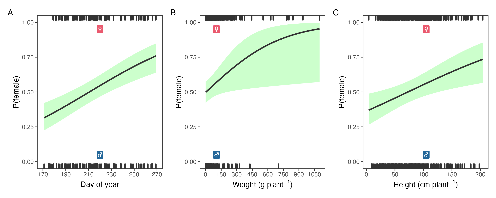

```{r include=FALSE}
library(kableExtra)
library(tidyverse)
```

\begin{abstract}

Palmer amaranth (\emph{Amaranthus palmeri} S. Watson) is one of the most troublesome agronomic weed species in the United States. Palmer amaranth is prevalent in the Southern Great Plains and Southeastern United States, and its range is expanding northward through natural dispersal and human intervention. Palmer amaranth dispersal warrants studies assessing species adaptation into new geographies. A study was conducted in 2018 and 2019 to investigate morphology, flowering and gender from cohorts of Palmer amaranth growing under corn, soybean, and bareground across five locations in the Midwest United States. Results demonstrated that the first cohort of Palmer amaranth, established in June, produced 42\% more biomass than plants from the second cohort (established in July). The first Palmer amaranth cohort produced 75.5 g plant\textsuperscript{-1} in bareground, 28.3 g plant\textsuperscript{-1} in soybean and 16.3 g plant\textsuperscript{-1} in corn, whereas the second Palmer amaranth cohort produced 62.6, 6.3, and 1.4 g plant\textsuperscript{-1} in bareground, soybean and corn, respectively. Palmer amaranth height was most impacted when growing in corn, and averaged 85.2 cm tall in the first cohort, and 38.2 cm tall in the second cohort in corn. Moreover, Palmer amaranth flowering window shifted according to crop and cohort timings. Palmer amaranth growing in intense competition, such as under low light in corn, resulted in the longest flowering window. Palmer amaranth gender was slightly influenced by day of year, weight and height. We documented a high degree of plasticity in Palmer amaranth, which will presumably favor its adaptation and expansion in cropping systems north of its current range. Therefore, preventing Palmer amaranth dispersal into new habitats is the most effective management strategy.

\tiny
 \keyFont{ \section{Keywords:} Evolution, Flowering, Weed management, Pigweed} 

\end{abstract}


# Introduction {-}
Palmer amaranth (*Amaranthus palmeri* S. Watson) is currently ranked as one of the most economically detrimental weed species to cropping systems in the United States [@vanwychen2020]. Unmanaged Palmer amaranth plants compete for water, light, and nutrients, which can drastically impact crop yields [@berger2015]. For example, Palmer amaranth has been documented to reduce up to 91%, 68%, and 54% corn [@massinga2001], soybean [@klingaman1994], and cotton [@morgan2001] yields, respectively. Moreover, Palmer amaranth has shown a remarkable capacity to evolve resistance to herbicides. To date, Palmer amaranth has evolved resistance to eight herbicide sites of action [@heap2022], increasing the weed management complexity [@lindsay2017] and posing an economical and ecological risk to row-crop agriculture.

Palmer amaranth as a problem weed is a function of both inherent adaptations and selected management practices. Palmer amaranth is a fast growing summer annual forb indigenous to the Sonoran Desert [@sauer1957]. It became a serious problem weed in US agriculture in the 1990s [@ward2013]. Palmer amaranth weediness is likely a result of human-assisted selection combined with plant biology. Farm mechanization, adoption of conservation agriculture (e.g., no-till), and intensive use of herbicides for weed management are the main human-mediated selections of Palmer amaranth in cropping systems [@ward2013]. Palmer amaranth is a prolific seed producer with a C4 photosynthetic apparatus [@wang1992]. With dioecious nature, Palmer amaranth male and female plants are obligate outcrossers, increasing the chances of exchanging adaptive traits among plants [@jhala2021; @oliveira2018]. Also, Palmer amaranth's small seeds (e.g, 1 mm) tend to thrive in no-tillage systems [@price2011], and spread across locations through farm equipment [@sauer1972], seed mixes [@hartzler2016], wildlife [@farmer2017], etc., making it one of the most successful examples of weed adaptation to current cropping systems. 


Palmer amaranth's plasticity allows it to respond successfully to environmental changes. Palmer amaranth demonstrates a high degree of plasticity to light, temperature, water availability, and human management [@jha2010]. Palmer amaranth has an extended germination period throughout the growing season [@ward2013]. Germination of Palmer amaranth was triggered by 18 \textdegree C soil temperature at 5 cm depth [@keeley1987], and optimal germination and biomass production occurred at 35/30 \textdegree C day and night temperatures [@guo2003]. Palmer amaranth emergence can be influenced by tillage and the use of preemergence herbicides [@chahal2021], and may result in weed germination shifts within a population, as documented in *Bassia scoparia* [@sbatella2010]. In an experiment where Palmer amaranth was subjected to continuous water stress, it survived and produced at least 14000 seeds plant\textsuperscript{-1} [@chahal2018]. Seeds from Palmer amaranth growing with limited water conditions were heavier, less dormant, and prompt for germination [@matzrafi2021]. Growing conditions and management practices also influence Palmer amaranth sex dimorphism and flowering pattern [@korres2017; @rumpa2019]. 

Palmer amaranth's current global range includes agronomic cropland in Italy [@milani2021], soybean producing regions of Brazil and Argentina [@larran2017; @kupper2017], and the Cotton Belt [@garetson2019; @bagavathiannan2016] and southern Great Plains of the United States [@kumar2020; @crespo2016a]. However, its range appears to be expanding steadily, and in some cases rapidly, in the United States. We hypothesize that in states with large Palmer amaranth infestations its range is gradually pushing north as it displaces other weeds in agronomic row crops, aided by wildlife [@farmer2017] and agricultural machinery [@ward2013]. But there are other examples where it has suddenly become a problem weed hundreds of miles away from known infestations. New infestations in Michigan, Indiana and North Dakota appear to have resulted from Palmer amaranth contaminated livestock feed. New infestations in Iowa and Minnesota were associated with planting contaminated pollinator habitat seed [@yu2021]. Palmer amaranth infestations have not been detected in Canada, but Palmer amaranth seeds were found in sweet potato slips imported into the country [@page2021]. Global warming will create new opportunities for Palmer amaranth invasion. Although agronomic crops in warm environments like Australia and Sub-Saharan Africa are currently at greatest risk for Palmer amaranth invasion, warming temperatures will reduce barriers that may have limited Palmer amaranths spread into cooler climates like Canada and Northern Europe [@kistner2018; @briscoerunquist2019]. 


There are many areas in the US Corn Belt (North Central states) where Palmer amaranth is not yet established, and its potential adaptability is untested. Nonetheless, the rapid expansion of Palmer amaranth across the Northern United States is concerning and warrants investigations on its adaptability. It has been shown that Palmer amaranth caused yield loss in Illinois soybean fields [@davis2015], but an Iowa study showed that Palmer amaranth was not as well adapted as waterhemp (*Amaranthus tuberculatus*) to conditions in that geography [@baker2021]. It also known that Palmer amaranth plants that establish shortly after row-crop planting have a much greater impact on crop yield than plants that emerge after the crop has produced several leaves [@macrae2013].  Understanding Palmer amaranth morphology and development under different agroecosystems and across a wide geography can enhance our knowledge of its adaptability, and may also aid in designing effective tactics to limit is range expansion and minimize its negative effects on row crops. The objective of this study was to investigate the flowering pattern, gender, biomass production, and height of Palmer amaranth cohorts growing in corn, soybean and bareground environments across five locations in the North Central United States.


# Material and Methods {-}

<!-- Comments should be HTML-style comments -->

## Plant material and growing conditions {-} 

A Palmer amaranth accession (Kei3) from Perkins County, Nebraska susceptible to glyphosate was selected for this study [@oliveira2021a]. Three weeks prior to the establishment of each cohort, seeds were planted in plastic trays containing potting-mix. Emerged seedlings (1 cm) were transplanted into 200 cm\textsuperscript{-3} plastic pots (one plant pot\textsuperscript{-1}). Palmer amaranth seedlings were supplied with adequate water and kept under greenhouse conditions at the University of Wisconsin-Madison, University of Nebraska-Lincoln, and Western Illinois University; and kept outdoors at the Perkins Extension office in Grant, NE until the 2-3 leaf stage (5 to 8 cm height) when they were transported to the field.

## Field study {-}  

The experiment was conducted in 2018 and 2019 under field conditions at five locations: Arlington, WI, Clay Center, NE,, Grant, NE, Lincoln, NE, and Macomb, IL.  

```{r fig1, echo = FALSE, message=FALSE, fig.show = "hide"}

```

Fields were conventionally tilled prior to crop planting. Corn and soybean were planted in 76-cm row spacing (Table 1). Monthly mean air temperature and total precipitation were obtained using Daymet weather data from June through September across the five locations in 2018 and 2019 [@correndo2021] (Figure 2).

```{r fig2, echo = FALSE, message=FALSE, fig.show = "hide"}

```


```{r echo=FALSE, warning=FALSE, message=FALSE}
options(knitr.kable.NA = '')
read_csv("../data/table.csv") %>% 
  janitor::row_to_names(row_number = 1) %>% 
  kable(booktabs = TRUE, caption = "Field study attributes ",
        col.names = c("Attributes",
                           "",
                           "Arlington, WI",
                           "Clay Center, NE",
                           "Grant, NE",
                      "Lincoln, NE", "Macomb, IL")) %>% 
#  pack_rows(
 #   index = c("Bareground" = 2, "Corn" = 4, "Soybean" = 8)) %>% 
  kable_styling(font_size = 10, 
                full_width = FALSE, 
                position = "center",
                latex_options = c("scale_down", "hold_position")) %>% 
  collapse_rows(columns = 1, latex_hline = "none", valign = "middle") %>%
  footnote(
           alphabet = c("glyphoste, 840 g ae ha", "S-metolachor, 1324 g ai ha;", 
                        "S-metolachlor + trazine + mesotrione, + bicyclopyrone, 2409 g ai ha;",
                        "saflufenacil + imazethapyr + pyroxasulfone, 215 g ai ha"),
           footnote_as_chunk = TRUE)
```


<!--  
 Acuron applied PRE in corn at 2.5 qt/acre; Zidua PRO applied PRE in soybean at 6 fl oz/acre
-->


The field experimental units were three adjacent 9.1 m wide (12 rows at 76.2 cm row spacing) by 10.7 m long. The experimental design were arranged in factorial design with three crops, two transplanting times simulating two cohorts, repeated across five locations. Each field experimental unit was planted with corn, soybean, or maintained as bareground. The two transplant timings were June 1 (first cohort) and July 1 (second cohort). Palmer amaranth seedlings (potting mix + two seedlings) were transplanted (6 cm deep and 8 cm wide). Forty-eight plants were equidistantly placed (0.76 m apart) between rows within each crop. After a week, one plant was eliminated and one was kept, resulting in 24 plants per experimental unit and transplanting time (Figure 3). When needed, Palmer amaranth plants were supplied with water during the first week after transplanting to assure seedling survival. 

```{r fig3, echo = FALSE, message=FALSE, fig.show = "hide"}
knitr::include_graphics("../data analysis/figures/Figure 3.png")
```


After transplanting, Palmer amaranth flowering was monitored until the end of the study. When a plant flowered, the day was recorded, plant gender was identified (male or female), plant height was measured from soil surface to the top of plant. Also, aboveground plant, and the aboveground plant organs were harvested, then oven dried at 65 \textdegree C until a constant weight was reached, and dry biomass (g plant\textsuperscript{-1}) was recorded. Plants were harvested at flowering because Palmer amaranth is not established at the Wisconsin or Illinois research locations. In our study, all locations followed the methodology of plant harvest at flowering initiation, except in Grant, NE. At the Grant, NE, location, all plants from the first cohort were harvested on July 6, 2018 or July 6, 2019, and all plants from the second cohort were harvested on August 17, 2018 or July 31, 2019, regardless of flowering status.

## Statistical analyses {-}  

The statistical analyses were performed using R statistical software version 4.0.1 [@rcoreteam2021].

Analyses of Palmer amaranth height and biomass were performed with a linear mixed model using *lmer* function from "lme4" package [@bates2015]. Plant height and biomass were log transformed to meet model assumption of normality. In the model, crop (bareground, corn, soybean) and cohort time (first and second) were the fixed effects and year nested with location were the random effects. Analysis of variance at $\alpha$ 0.05 was performed with *anova* function from "car" package [@fox2018]. Marginal means and compact letter display were estimated with *emmeans* and *cld* from packages "emmeans" [@lenth2021] and "multcomp" [@hothorn2008], respectively.  

Palmer amaranth cumulative flowering estimation was determined across all locations, except Grant, NE. Cumulative flowering estimation was determined using an asymmetrical three parameter log logistic Weibull model of the drc package [@ritz2015]:

$$Y(x) = 0 + (d-0) exp (-exp(b(log(x)-e)))$$


In this model, *Y* is the cumulative flowering, *d* is the upper limit (set to 100), and *e* is the inflection point, and *x* is the day of year (doy). 

The doy for 10, 50, and 90% cumulative flowering were determined using the *ED* function of drc package. Also, the 10, 50, and 90% Palmer amaranth cumulative flowering were compared among crops and cohorts using the *EDcomp* function of drc package. The EDcomp function compares the ratio of cumulative flowering using t-statistics, where P-value < 0.05 indicates that we fail to reject the null hypothesis.  

A binary logistic regression was fitted to Palmer amaranth gender. Binary logistic regression is used for predicting binary classes [@bangdiwala2018], such as the probability of a plant being female in a dioecious species. Prior to the analysis, missing values were removed from the dataset (including all data from the Grant location). The resulting dataset was split into 80% train and 20% test data. The 80% train is used for model training and the 20% test is used for checking model performance on unseen dataset. Using the 80% train data, a generalized linear model (base R *glm* function) was fitted to binary response variable, the probability of being female (0 to male and 1 to female). The independent variables were harvest day of year, height, weight, and crop (without interaction). The model family was binomial with a logit function. The model fit was assessed through pseudo R-squared values (McFadden, Cox and Snell, Cragg and Uhler) and likelihood ratio using *nagelkerke* function from "rcompanion" package [@mangiafico2021]. The marginal effects computation was performed with Average Marginal Effects (AMEs) at every observed value of x and averaged across the results [@leeper2017] using *margins* function from "margins" package [@leeper2021]. The 20% test data was predicted using the *predict* function with a cutoff estimation for male or female using *performance* function from ROCR package [@sing2005]. The model quality prediction from the classification algorithm was measured with precision (*precision* function), recall (*recall* function) and F1-score (*f_meas* function) using the "yardstick" package [@kuhn2021]. The precision determines the accuracy of positive predictions (female plants), recall determines the fraction of positives that were correctly identified, and F1-score is a weighted harmonic mean of precision and recall with the best score of 1 and the worst score of 0 [@raoniar2021]. F1-score conveys the balance between the precision and the recall [@yacouby2020]. The area under the receiver operating curve (AUC-ROC) was also estimated with performance function using the true positive and false positive rates. The higher the AUC, better the model is at distinguishing between female and male Palmer amaranth.


# Results {-}

<!-- Comments should be HTML-style comments -->


## Palmer amaranth height and biomass {-}  

Palmer amaranth plants accumulated more biomass when growing in bareground compared to plants growing in soybean and corn (Figure 4A). Palmer amaranth plants in the first cohort produced 75.5, 28.3, and 16.3 g plant\textsuperscript{-1} in bareground, soybean and corn, respectively. Plants from the second cohort produced 62.6 g plant\textsuperscript{-1} in bareground, followed by 6.3 g plant\textsuperscript{-1} in soybean, and 1.4 g plant\textsuperscript{-1} in corn.   

```{r fig4, echo = FALSE, message=FALSE, fig.show = "hide"}
knitr::include_graphics("../data analysis/figures/Figure 4.png")
```

Palmer amaranth height was less affected by cohort timing than was weight, with the exception of plants growing in corn (Figure 4B). Plants from the first cohort were on average 69.2 cm tall in bareground, which was not different from the 70.7 cm tall plants from the second cohort timing (P = 0.74). In addition, no difference in Palmer amaranth height (69.3 cm) was detected from first cohort plants in soybean to first and second cohort plants in bareground (P > 0.75). Palmer amaranth plants from the second cohort were nearly 10 cm shorter compared to the first cohort in soybeans (P = 0.04). The tallest (85.2 cm, first cohort) and shortest (38.2 cm, second cohort) plants were observed in corn.  


## Palmer amaranth cumulative flowering {-}  

The initiation and duration of Palmer amaranth flowering were strongly influenced by cohort and surrounding vegetation (Figure 5A, 4B). In the first cohort, floral initiation (10% flowering) occurred near the end of June for all three treatments, at doy 180, 180.9, and 181.7 for soybean, bareground, and corn, respectively.  In the second cohort, floral initiation occurred earlier on plants growing in the bareground than plants growing in soybean or corn (doy 203.8 versus doy 210.9 or 216.8, respectively). Palmer amaranth growing in the bareground had the shortest flowering initiation (measured as the difference between 10% and 90% cumulative flowering) in both the first (34 days) and second (28 days) cohorts. Palmer amaranth growing in soybean had a shorter duration of flowering than corn in the first cohort (40 days vs 71 days), but a longer duration in the second cohort (50 vs 44 days). 

```{r fig5, echo = FALSE, message=FALSE, fig.show = "hide"}
knitr::include_graphics("../data analysis/figures/Figure 5.png")
```

Palmer amaranth cumulative flowering in the second cohort occurred from mid July to mid September (Figure 5B). Palmer amaranth growing in the bareground resulted in earlier flowering time compared to soybean and corn. Palmer amaranth growing in bareground reached 10%, 50%, and 90% flowering time at day 203.8, 214.4, and 232.2, respectively. Palmer amaranth growing in soybean reached 10% flowering at doy 210.9, which was 6 days prior to corn (*P*-value = 0.00). Similar trend was observed at 50% flowering, whereas Palmer amaranth reached 50% flowering in corn (doy 233.0) 4 days after soybeans (doy 228.9; *P* = 0.00). The 90% Palmer amaranth cumulative flowering occurred at same day in corn (260.9) and soybean (260.5; *P* = 0.66).  

## Palmer amaranth gender {-} 

The model goodness of fit was 0.23, 0.32, 0.40 using pseudo R-squared test from McFadden, Cox and Snell, and Cragg and Uhler, respectively. The likelihood ratio test showed a p-value of 0.00. The average marginal effects showed that Palmer amaranth growing in corn resulted in 14.8% fewer females plants (Table 2). Moreover, increasing a cumulative flowering unit doy increases the probability of having a female plant by 0.4% (Table 2 and Figure5A). A similar trend was observed for weight (Figure 6B) and height (Figure 6C), where the probability of being female increased 0.1% and 0.2% for each unit increase of weight and height, respectively (Table 2).


```{r echo = FALSE, warning = FALSE, message=FALSE}
readr::read_csv("../data/table_a.csv") -> table_a
  
table_a %>% 
  kableExtra::kable(booktabs = TRUE, escape = TRUE, caption = "Average marginal effects of Palmer amaranth gender logistic model. Factor pararemter values (crop_corn and crop_bareground) are calculated relative to soybean.") %>% 
  kable_styling(font_size = 10, 
                full_width = FALSE, 
                position = "center",
                latex_options = c("hold_position")) %>% 
  collapse_rows(columns = 1, latex_hline = "none", valign = "middle") %>%
  footnote(
           alphabet = c("Average Marginal Effects.", "Standard Error."),
           footnote_as_chunk = TRUE)
```


```{r fig6, echo = FALSE, message=FALSE, fig.show = "hide"}

```

The model accuracy evaluation accuracy in the 20% test dataset was 0.62 with a cutoff value for female and male plants of 0.43. The model classification showed a precision of 0.64, recall of 0.66, and a F1-score of 0.65. In addition, the AUC was 0.64.  


# Discussion {-}

Our study demonstrate that Palmer amaranth is well adapted to growing conditions throughout the Midwestern US, and is simply limited in its range by seed dispersal (Davis et al. 2015). We also confirmed Palmer amaranth's extraordinary plasticity to adapt to different agroecosystems. For example, Palmer amaranth mimicked crop architecture in competing for light, where plants growing in corn allocated resources to height, while plants growing in bareground allocated resources to numerous branches. Plants growing in the absence of a crop produced the greatest biomass, responding to a greater abundance of light, nutrient and water resources (Figure 4A, 3B). These results support the argument that Palmer amaranth can quickly evolve life-history traits to adapt to different cultural practices, similar to observations in a Palmer amaranth response to nitrogen study [@bravo2018]. Our results highlight Palmer amaranth as a threat to field crops and breeding more competitive crop varieties is likely to select more competitive weed biotypes [@bravo2017].   

```{r fig7, echo = FALSE, message=FALSE, fig.show = "hide", include = FALSE}

```


Palmer amaranth growth and development in the second cohort was limited due to the crop competitive ability at advanced developmental stages. Palmer amaranth seedling were transplanted at greater crop height and width, which reduced Palmer amaranth competitiveness. As a result, Palmer amaranth height and biomass were lower compared to its first cohort. Moreover, Palmer amaranth growing without crop competition produced the highest amounts of biomass. The Palmer amaranth strategy in bareground was to invest biomass in growing plant width and height. Nonetheless, Palmer amaranth produced 17% less biomass in second cohort compared to first cohort timing. In a bareground study, early emerged Palmer amaranth without competition was 50% taller than late emerged plants [@webster2015]. These results suggest that crop competition is not the only factor limiting late Palmer amaranth establishment. The limited growth of Palmer amaranth at second cohort is likely a reduced plant response to day length, light availability and thermal units (e.g, growing degree days). The *Amaranthus* species are sensitive to photoperiod [@wu2014]. We hypothesize that reduced day length or red/far-red effect contributed to smaller plants at second cohort regardless the crop. A study in North Carolina and Illinois predicted that less than 10% Palmer amaranth seedlings emergence occurred after June [@piskackova2021]. In addition, Palmer amaranth negative impact on soybean [@korres2020] and cotton [@webster2015] yields was higher when plants were established close to crop planting. Therefore, early season management is a key strategy to minimize the damaging impact of Palmer amaranth to US Midwest cropping systems. 

Seed production was not evaluated due to plant harvest at initiation of flowering. Nonetheless, a strong positive correlation between Palmer amaranth biomass and seed production has been documented [@schwartz2016; @spaunhorst2018]. In our study, plants growing from the first cohort accumulated 42% more biomass when compared to the second cohort. Therefore, Palmer amaranth plants growing in the second cohort are likely to produce fewer seeds regardless of crop. Our observation is consistent with the findings that the first Palmer amaranth cohort produced 50% more seeds per plant than Palmer amaranth plants established six weeks later in bareground [@webster2015]. Still, seed production at the second cohort will replenish the soil seedbank. Seed production and deposition in the seedbank is also a key factor for species perpetuation [@menges1987]. Palmer amaranth can produce more than hundred thousands seeds per plant [@schwartz2016; @keeley1987], which can stay viable in the soil seedbank for at least 36 months [@sosnoskie2013]. Therefore, preventing Palmer amaranth seed production or/and seed migration to non-native habitats is an essential strategy to minimize the species impact in agroecosystems.  

An ecological approach to reduce Palmer amaranth seed production encompasses understanding plant biology, including flowering pattern. Floral initiation depends on the complex interaction between a plant's genetic makeup and environmental conditions [@lang1965].  We observed a significant disruption in flowering caused by surrounding vegetation and cohort timing.  Although all three treatments began flowering at the same time in the first cohort (about doy 180), it took much less time for the bareground treatment to reach 90% flowering (34 days versus 40 for soybean and 71 for corn). The lack of competition (and stress) in the bareground resulted in plants that flowered earlier, and were they not harvested, would have had longer reproductive periods, thereby producing more seed. Similarly, in the second cohort, the window for all plants to initiate flowering was much shorter for the bareground (28 days) compared to Palmer amaranth in soybean (50 days) or corn (44 days). Significantly, plants in the bareground treatment flowered one week earlier than soybean, and almost two weeks earlier than corn, again allowing for greater seed production per plant had they not been harvested at initial flowering. In some cases, early flowering may confer an evolutionary advantage, provided the plant has an indeterminate habit and flowering does not restrict plant growth. In other cases, however, early flower initiation may be a response to stressful conditions as a plant attempts to reproduce before running out of resources. In an Iowa study, Palmer amaranth initiated flowering two weeks prior to waterhemp [@baker2021], and this characteristic may partially explain why waterhemp can displace Palmer amaranth in Iowa, where Palmer amaranth is not well adapted. In a dioecious species like Palmer amaranth, exerting stress on plants to manipulate flowering may be beneficial in limiting seed production [@mcfarlane2018; @schliekelman2005]. For example, when growing under water stress, there was a seven days flowering mismatch between male and female plants [@mesgaran2021], which can minimize plant outcrossing, reduce seed production and the exchange of resistant alleles [@jhala2021]. 


The mechanisms of gender-determination in plant species is intriguing and has arouse the curiosity of many scientists, including Charles Darwin [@darwin1888]. In our study, the gender model performance was decent (AUC 0.64) considering the biology of plant flowering. A 1:1 male and female sex ratio is a general and evolutionarily stable strategy for plant species perpetuation [@fisher1930]. However, a slight deviation from 1:1 sex ratio occurs in some dioecious species. For example, the dioecious *Halophila stipulacea* is a female-biased plant in its native habitat, but the naturalized *H. stipulacea* has a 1:1 ratio [@nguyen2018]. Naturalization of *H. stipulacea* reduced female-male ratio to expand into its non-native habitat [@nguyen2018]. Also, biotic and/or abiotic stress can influence plant gender determination. Palmer amaranth  male-to-female ratio was greater under high plant densities [@korres2017a] and after herbicide application [@rumpa2019]. We observed sexual dimorphism in Palmer amaranth in response to surrounding vegetation and plant morphological attributes. Our model estimated that late flowering, heavier and taller Palmer amaranth plants slightly deviated from 1:1 ratio in favor of female plants. It was reported that female Palmer amaranth plants invested more in height, stem and biomass while male plants invested more in leaf area and leaf dry weight under nutrient deficiency [@korres2017]. We observed more female plants in soybean and bareground compared to corn. Palmer amaranth plants in the corn were more stressed by interspecific competition as evidenced by less biomass and a lower weight:height ratio. Sexual dimorphism is documented in other dioecious species [@barrett2013]. For example, stronger female plant competition and greater male tolerance to herbivory was reported in *Spinacia oleracea* [@perez-llorca2019]. Research on candidate genes for sex determination in *Amaranthus* species are currently underway but is far from complete [@montgomery2021; @montgomery2019]. Further studies are also needed to understand the ecological basis of Palmer amaranth flowering, including plant behavior under climate change.  

Our study demonstrated that Palmer amaranth is adapted to grow on arable land throughout the north central United States. Palmer amaranth's range will continue to expand if current cropping practices are continued. As waterhemp and Palmer amaranth begin to share the same habitat, it will increase weed management complexity. Preventing Palmer amaranth seed dispersal must be a priority. Regional collaboration is necessary to slow the spread of this aggressive and adaptable weed. Where Palmer amaranth occurs, management tactics should focus on limiting Palmer amaranth establishment until row crops can shade late-emerging plants. Increasing the diversity of crops in rotation, varying row crop planting date, narrowing row width, and increasing residue cover through the use of cover crops are all tactics that can minimize the growth and seed production of Palmer amaranth, and improve the sustainability of US North Central cropping systems.


# Disclosure/Conflict-of-Interest Statement {-}

The authors declare that the research was conducted in the absence of any
commercial or financial relationships that could be construed as a potential
conflict of interest.

# Data accessibility {-}

The data and scripts used to analyse the data presented in this work can be found at Zenodo [@oliveira2021b].

# Author Contributions {-}

RW and MO: designed the experiments; AJ, CP, MB, MO, and SS: conducted the experiments; MO: analyzed the data; MO: wrote the manuscript and all authors revised; AJ, CP, MB, MO, SS, and RW: conceptualized the research. All authors reviewed the manuscript. 


# Acknowledgments {-}

Funding: This work received no specific grant from any funding agency, commercial, or not-for-profit sectors.

# References {-}

::: {#refs}
:::


\newpage

# Figures {-}

```{r, Figure-1, ref.label = "fig1", echo = FALSE, message = FALSE, fig.height=3, fig.width=6, fig.align='center', fig.cap='Field research locations in the north central United States region.', out.width = "160mm", out.height = "90mm"}
# You can also refer to code chunks from above to place figures at the bottom.
```

```{r, Figure-2, ref.label = "fig2", echo = FALSE, message = FALSE, fig.height=3, fig.width=6, fig.align='center', fig.cap='Mean average temperature (C) and total montly precipitation (mm) at Arlington, WI, Clay Center, NE, Grant, NE, Lincoln, NE and Macomb, IL.', out.width = "160mm", out.height = "100mm"}
# You can also refer to code chunks from above to place figures at the bottom.
```


```{r, Figure-3, ref.label = "fig3", echo = FALSE, message = FALSE, fig.height=3, fig.width=6, fig.align='center', fig.cap='Palmer amaranth adaptation study layout of a plant cohort timing in bareground, corn, and soybean. Twenty-four Palmer amaranth plants were place 76.2 cm apart in each field experimental unit.', out.width = "150mm", out.height = "70mm"}
# You can also refer to code chunks from above to place figures at the bottom.
```


```{r, Figure-4, ref.label = "fig4", echo = FALSE, message = FALSE, fig.height=9, fig.width=4, fig.align='center', fig.cap='Palmer amaranth biomass (A) and height (B) growing in corn, bareground, and soybean nested across Arlington, WI, Clay Center, NE, Grant, NE, Lincoln, NE and Macomb, IL.', out.width = "150mm", out.height = "90mm"}
# You can also refer to code chunks from above to place figures at the bottom.
```


```{r, Figure-5, ref.label = "fig5", echo = FALSE, message = FALSE, fig.height=9, fig.width=4, fig.align='center', fig.cap='Cumulative flowering of Palmer amaranth at first and second transplant timing (A) and day of year of 10, 50, and 90 cumulative flowering at first and second cohort transplanting time (B) nested across Arlington, WI, Clay Center, NE, Grant, NE, Lincoln, NE and Macomb, IL.', out.width = "150mm", out.height = "150mm"}
# You can also refer to code chunks from above to place figures at the bottom.
```


```{r, Figure-6, ref.label = "fig6", echo = FALSE, message = FALSE, fig.height=9, fig.width=4, fig.align='center', fig.cap='The probability (P) of being female Palmer amaranth by day of year (A), weight (B), and height (C). Black line represents the model estimation and shaded green the confidence intervals.', out.width = "170mm", out.height = "70mm"}
# You can also refer to code chunks from above to place figures at the bottom.
```


```{r, Figure-7, include=FALSE, ref.label = "fig7", echo = FALSE, message = FALSE, fig.height=9, fig.width=4, fig.align='center', fig.cap='MCO (first manuscript author, 180 cm) holds harvested Palmer amaranth plants at 40 days after first cohort transplanting (A) and 33 days after second cohort transplanting (B) time. From left to right in each image, Palmer amaranth growing in bareground, soybean and corn in Arlington, Wisconsin.', out.width = "150mm", out.height = "90mm"}
# You can also refer to code chunks from above to place figures at the bottom.
```
